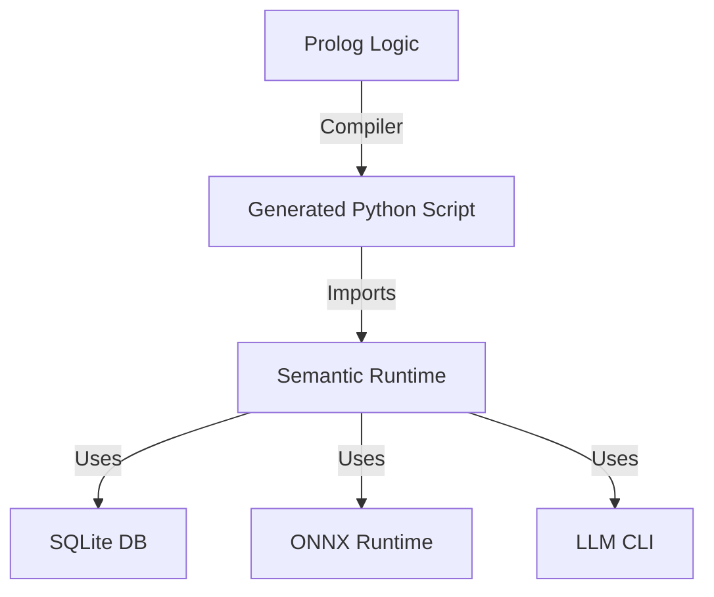

# Chapter 1: The Python Semantic Target

The Python target in UnifyWeaver is designed for building **Intelligent Semantic Agents**. Unlike the Bash target (optimized for pipe-based text processing) or the Go target (optimized for high-performance, compiled binaries), the Python target focuses on **Integration, AI, and Semantic Analysis**.

## 1.1 Why Python?

Python is the lingua franca of Data Science and AI. By targeting Python, UnifyWeaver allows your declarative logic to seamlessly tap into the vast ecosystem of AI tools:
*   **LLMs**: Integration with Gemini, GPT, Claude, and local models.
*   **Vector Search**: Easy access to libraries like FAISS, Chroma, or simple NumPy-based cosine similarity.
*   **Data Processing**: Pandas, NumPy, and Scikit-learn.
*   **Web**: Beautiful Soup, Scrapy, and Requests.

## 1.2 Architecture

The Python target generates **Scripts** that embed a lightweight **Runtime Library**.



### The Runtime Library
The runtime (`src/unifyweaver/targets/python_runtime/`) is injected directly into the generated script (or imported if installed). Key components include:
*   **`PtImporter`**: Handles SQLite storage of Objects, Links, and Vectors.
*   **`PtCrawler`**: An XML/HTML streaming crawler with link extraction.
*   **`PtSearcher`**: Performs Vector Search and Graph Traversal.
*   **`LLMProvider`**: Wraps the `gemini` CLI for RAG tasks.

## 1.3 Your First Semantic Script

Let's create a simple script that searches for a topic using an LLM.

```prolog
:- module(hello_semantic, [main/0]).
:- use_module(unifyweaver(targets/python_target)).

ask_ai(Question, Answer) :-
    llm_ask(Question, [], Answer).

main :-
    compile_predicate_to_python(hello_semantic:ask_ai/2, [mode(procedural)], Code),
    write_file('ask.py', Code).
```

Compile and run:
```bash
swipl -g main -t halt hello.pl
python3 ask.py
```

In the next chapters, we will explore **Graph RAG**, where we combine Vector Search with Graph Traversal to give the AI "memory" of your data.

---

## Navigation

[📖 Book 13: Semantic Search](./) | [Next: Chapter 2: Graph Retrieval-Augmented Generation (G... →](02_graph_rag)
