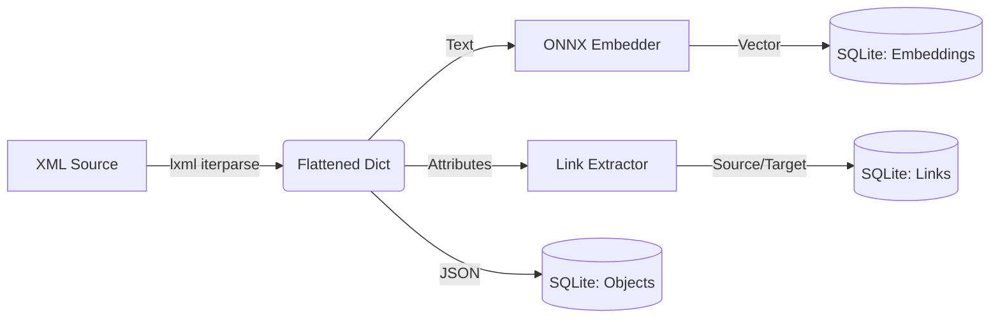

# Chapter 3: The Semantic Data Pipeline

In the previous chapter, we saw how to *search* data. But how does the data get there?

The Python target includes a robust **Semantic Data Pipeline** capable of ingesting, flattening, and embedding complex hierarchical data (like XML/RDF) into a queryable format.

## 3.1 The Pipeline Stages

The pipeline consists of three stages, orchestrated by `PtCrawler`:

1.  **Fetch**: Retrieve raw content (XML files, URLs).
2.  **Flatten**: Convert hierarchical XML into flat Python dictionaries.
3.  **Enrich & Store**:
    *   **Embed**: Generate vector embeddings for text.
    *   **Link**: Extract graph relationships (`pt:parentTree`).
    *   **Persist**: Save to SQLite.



## 3.2 XML Flattening Strategy

UnifyWeaver uses a specific "Flattening" strategy optimized for RDF and Property Graphs.

**Input XML (RDF):**
```xml
<pt:PagePearl rdf:about="http://pearltrees.com/id/123">
    <dcterms:title>My Page</dcterms:title>
    <pt:parentTree rdf:resource="http://pearltrees.com/id/456" />
</pt:PagePearl>
```

**Flattened Python Dict:**
```python
{
    "@tag": "PagePearl",
    "@about": "http://pearltrees.com/id/123",  # Attributes get '@' prefix
    "title": "My Page",                        # Child text becomes key
    # pt:parentTree is processed as a link, not just data
}
```

This structure allows the `PtSearcher` to return clean, JSON-serializable data objects without the complexity of the original DOM.

## 3.3 Link Extraction

One of the most powerful features of the `PtCrawler` is automatic link extraction. It scans the flattened data for standard relationship attributes:

*   `rdf:resource`
*   `resource`
*   Attributes ending in `}resource` (Namespaced)

When found, it creates a directed edge in the `links` table:
*   **Source**: The current object's ID (`@about` or `@id`).
*   **Target**: The value of the resource attribute.

This builds the graph that enables **Graph RAG**.

## 3.4 Embedding Cache

Embedding models are computationally expensive. For iterative development, cache embeddings to disk:

### Cache Strategy

```python
import hashlib
import numpy as np
from pathlib import Path

def get_cache_key(data_config: dict) -> str:
    """Generate unique key from data configuration."""
    key_str = "|".join([
        data_config["data_dir"],
        ",".join(sorted(data_config.get("subdirs", []))),
        str(data_config.get("max_items", "all")),
        data_config["embedder_name"],
    ])
    return hashlib.md5(key_str.encode()).hexdigest()[:12]

def load_or_embed(texts, embedder, cache_path):
    """Load from cache or embed and save."""
    if cache_path.exists():
        data = np.load(cache_path)
        return data["embeddings"]

    embeddings = embedder.encode(texts)
    np.savez_compressed(cache_path, embeddings=embeddings)
    return embeddings
```

### Performance Impact

Caching provides **200-1000x speedup** for iterative development:

| Model | First Run | Cached | Speedup |
|-------|-----------|--------|---------|
| all-MiniLM-L6-v2 (384d) | ~7s / 644 items | 0.03s | ~230x |
| nomic-embed-text-v1.5 (768d) | ~36s / 644 items | 0.03s | ~1200x |

### Cache Invalidation

The cache key includes:
- Data directory path
- Subdirectories included
- Maximum items limit
- Embedder model name

Changing any of these creates a new cache file. Use `force_recompute=True` to regenerate manually.

### Storage Format

```
embeddings_cache/
├── embeddings_all-minilm_93580adb4bd7.npz
└── embeddings_modernbert_cd1428fa3e83.npz
```

Each `.npz` file contains:
- `embeddings`: The embedding vectors (N × dim)
- `ids`: Original item identifiers
- `metadata`: Any additional fields needed for reconstruction

## 3.5 Running a Crawl

To trigger this pipeline, use the `crawler_run/2` predicate in your Prolog script:

```prolog
index_my_data :-
    % Crawl 'data.rdf', expanding links up to depth 2
    crawler_run(['data.rdf'], 2).
```

The compiler generates Python code that initializes the `PtCrawler` and executes the pipeline efficiently using streams.

---

## Navigation

**←** [Previous: Chapter 2: Graph Retrieval-Augmented Generation (G...](02_graph_rag) | [📖 Book 13: Semantic Search](./) | [Next: Chapter 4: Logic and Recursion in Python →](04_logic_and_recursion)
