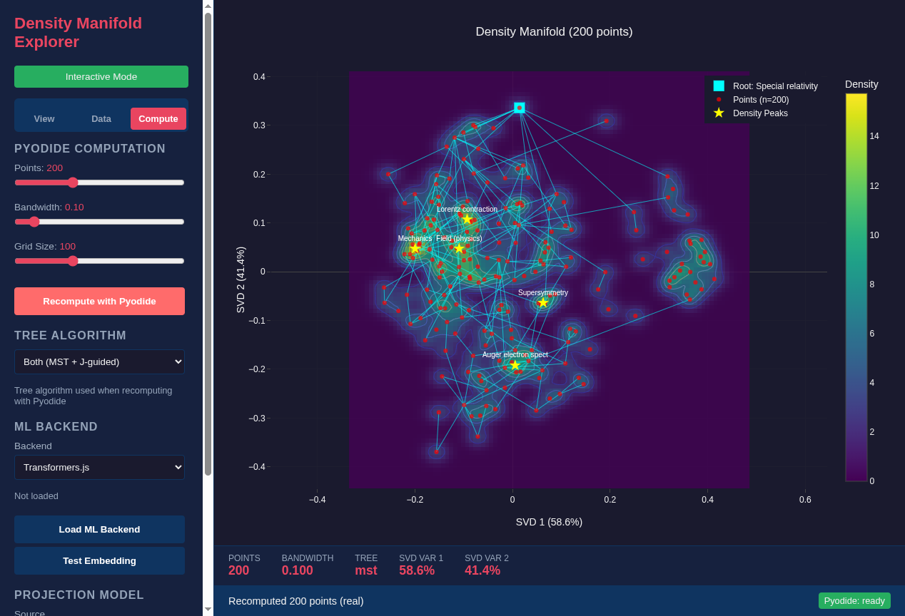

<!--
SPDX-License-Identifier: MIT AND CC-BY-4.0
Copyright (c) 2026 UnifyWeaver Contributors

This documentation is dual-licensed under MIT and CC-BY-4.0.
-->

# Chapter 1: Introduction

## Why Geometry Matters for Semantic Search

When we embed text into high-dimensional vectors, we create a geometric space. The shape of that space — its distances, densities, and curvatures — determines what a search engine can find and how it organizes results.

Most semantic search systems treat embeddings as black boxes: compute cosine similarity, return the top-k results. But the geometry contains far more information than similarity scores. Density reveals clusters. Distances encode relationships. Curvature identifies structurally important nodes. Tree algorithms recover hierarchies.

This book explores these geometric properties using tools we built in the UnifyWeaver project.

## The Density Manifold Explorer

Our primary tool is the **Density Manifold Explorer**, a browser-based application for visualizing embedding geometry:

*The Density Manifold Explorer showing 200 Wikipedia physics articles projected to 2D via SVD, with density contours, tree overlay, and interactive controls.*

The explorer combines several visualization layers:

- **Points** — Each dot is an embedded document, positioned by SVD projection
- **Density contours** — Kernel density estimation reveals where documents cluster
- **Tree overlay** — Minimum spanning tree or J-guided tree shows hierarchical connections
- **Density peaks** — Local maxima identify natural cluster centers

## What We Built

Over the course of this book, we'll examine several tools and their geometric foundations:

1. **Embedding projections** — SVD, weight space, and learned metric projections (Chapter 2, 7)
2. **Density estimation** — KDE with automatic bandwidth selection (Chapter 3)
3. **Distance models** — Neural networks that learn hierarchical distance functions (Chapter 4)
4. **Tree algorithms** — MST and J-guided trees that recover hierarchy from geometry (Chapter 5)
5. **Fisher information** — Why hub nodes sit at geometric boundaries, not density peaks (Chapter 6)
6. **Projection modes** — How different geometric views reveal different structure (Chapter 7)

## A Central Result

The most striking result in this book: a minimum spanning tree algorithm, given only pairwise distances from a trained neural network, independently selects "Physics" as the root node of a tree spanning 200 Wikipedia physics articles. No category labels, no hierarchy annotations — just distances. The hierarchy is implicit in the metric geometry.

## Code and Data

All examples use:
- **Dataset**: 200 Wikipedia physics articles with Nomic 768D embeddings
- **Models**: Trained distance models in `models/wikipedia_physics_distance.pt`
- **Tools**: Density explorer at `tools/density_explorer/`
- **Example scripts**: `tools/density_explorer/examples/`

---

**Next**: [Chapter 2: Embedding Spaces](02_embedding_spaces.md)
