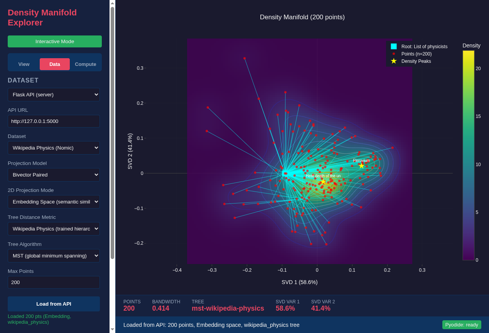

<!--
SPDX-License-Identifier: MIT AND CC-BY-4.0
Copyright (c) 2026 UnifyWeaver Contributors

This documentation is dual-licensed under MIT and CC-BY-4.0.
-->

# Chapter 3: Density Manifolds

## Kernel Density Estimation

When we project embeddings to 2D, the resulting point cloud has structure: clusters, ridges, voids. Kernel density estimation (KDE) reveals this structure by smoothing the point cloud into a continuous density surface.

For each point in a 2D grid, KDE computes:

```
density(x) = (1/N) * sum( K((x - x_i) / h) )
```

where `K` is a kernel function (typically Gaussian), `h` is the bandwidth parameter, and `x_i` are the projected points.



*200 Wikipedia physics articles with density contours (color gradient), MST tree overlay (cyan edges), and density peaks (labeled). The three peaks — Work (thermodynamics), Atom, Geoffrey Chew — represent natural cluster centers.*

## Bandwidth Selection

The bandwidth `h` controls the smoothing level:
- **Too small**: Every point is its own peak, no structure visible
- **Too large**: Everything blurs into one cluster
- **Optimal**: Reveals the natural scale of clustering

The density explorer uses Scott's rule as a starting point:

```python
def scott_bandwidth(points_2d):
    n = len(points_2d)
    d = 2  # dimensions
    return n ** (-1.0 / (d + 4))
```

Users can then adjust via a slider to explore structure at different scales.

## Convex and Concave Regions

The density surface has two types of regions with different geometric significance:

**Concave regions** (density peaks): High density, surrounded by lower density. These are cluster centers — groups of semantically similar documents. Moving a point within a concave region barely changes the density landscape.

**Convex regions** (ridges and saddle points): The density surface curves upward. These are transition zones between clusters. Points here are geometrically influential — small perturbations reshape the density landscape.

This distinction matters because structurally important nodes often sit at convex boundaries rather than at density peaks. "Physics" as a concept connects multiple clusters (thermodynamics, mechanics, quantum theory) without being deep inside any single cluster.

## Density Peaks

The explorer identifies local maxima in the density surface. These peaks correspond to the most representative documents in each cluster:

```python
def find_peaks(density_grid, n_peaks=5):
    """Find local maxima in the density grid."""
    from scipy.ndimage import maximum_filter
    local_max = (density_grid == maximum_filter(density_grid, size=20))
    peak_coords = np.argwhere(local_max)
    # Sort by density value, return top n
    peak_values = [density_grid[y, x] for y, x in peak_coords]
    top_indices = np.argsort(peak_values)[-n_peaks:]
    return peak_coords[top_indices]
```

## Density and Tree Structure

The density manifold and tree overlay provide complementary views:
- **Density** shows where documents cluster (statistical structure)
- **Tree** shows how documents connect (graph structure)

A node can be a density peak (many similar neighbors) without being a tree hub (many hierarchical connections), and vice versa. This duality is central to understanding semantic geometry.

---

**Previous**: [Chapter 2: Embedding Spaces](02_embedding_spaces.md) | **Next**: [Chapter 4: Learned Distances](04_learned_distances.md)
