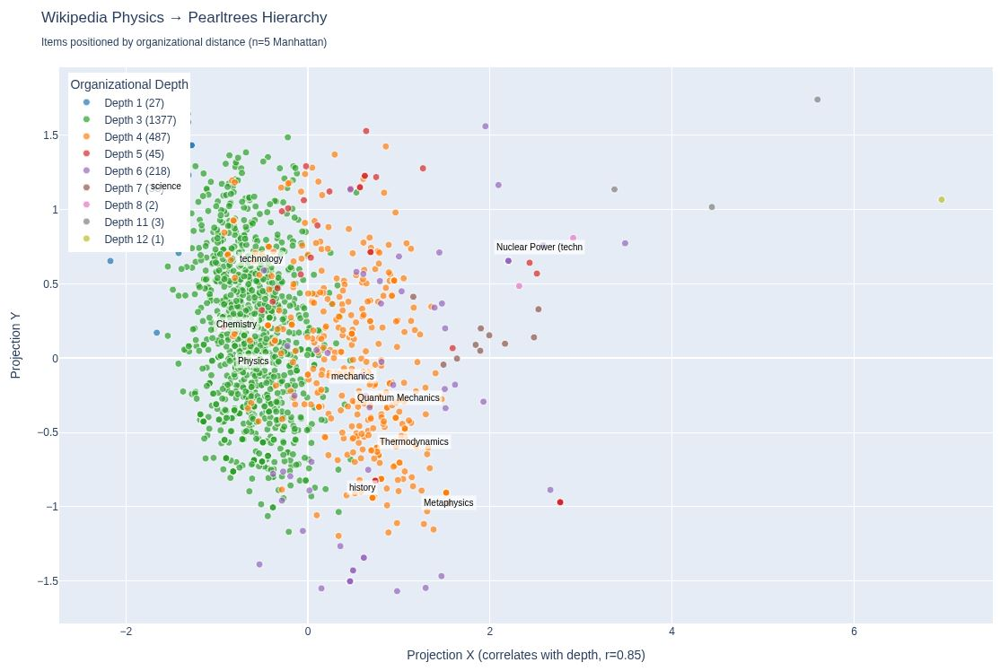

<!--
SPDX-License-Identifier: MIT AND CC-BY-4.0
Copyright (c) 2026 UnifyWeaver Contributors

This documentation is dual-licensed under MIT and CC-BY-4.0.
-->

# Chapter 4: Learned Distances

## Why Learn a Distance Function?

Cosine similarity between embeddings tells us what texts mean similar things. But it doesn't tell us how they're organized. "Physics" and "Quantum Mechanics" have high cosine similarity (~0.85), but so do "Physics" and "List of Physicists" (~0.80). The hierarchical relationship — parent vs. sibling vs. index — is invisible in the raw embedding geometry.

To recover organizational structure, we train a neural network to predict **hierarchical distance** between document pairs.

## The Wikipedia Physics Distance Model

The model maps pairs of 768D Nomic embeddings to a scalar distance prediction:

```python
class WikipediaPhysicsDistance(nn.Module):
    def __init__(self, embed_dim=768, hidden_dim=256, proj_dim=64):
        super().__init__()
        # Independent projection paths for query and target
        self.query_proj = nn.Sequential(
            nn.Linear(embed_dim, hidden_dim),  # 768 -> 256
            nn.ReLU(),
            nn.Linear(hidden_dim, proj_dim)     # 256 -> 64
        )
        self.target_proj = nn.Sequential(
            nn.Linear(embed_dim, hidden_dim),  # 768 -> 256
            nn.ReLU(),
            nn.Linear(hidden_dim, proj_dim)     # 256 -> 64
        )
        # Distance prediction from concatenated projections
        self.distance_head = nn.Sequential(
            nn.Linear(proj_dim * 2, hidden_dim),  # 128 -> 256
            nn.ReLU(),
            nn.Linear(hidden_dim, 1)               # 256 -> 1
        )
```

The architecture has three key properties:

1. **Asymmetric projections** — Query and target embeddings pass through separate projection networks. This allows the model to learn different roles: the query path captures "what kind of concept is this?" while the target path captures "where does this sit in the hierarchy?"

2. **Bottleneck at 64D** — Both paths compress from 768D to 64D. This 64-dimensional representation is the model's learned geometric space — and it turns out to encode organizational structure.

3. **Concatenated distance head** — Rather than computing a fixed metric (like L2 or cosine), the model learns a flexible distance function from the concatenated projections. This allows it to capture asymmetric or non-metric relationships.

## Training Data

The model trains on pairs of documents with known hierarchical distances. The training data combines two sources:

- **Wikipedia** — Article category paths (e.g., Physics → Classical mechanics → Newton's laws)
- **Pearltrees** — User-curated hierarchical collections mapping the same articles

### Effective Distance with Multiple Paths

Two articles can be connected by multiple paths through a category graph. Rather than using just the shortest path, we aggregate all paths using a p-norm formula:

```
d_eff = (Σ dᵢ^(-n))^(-1/n)
```

where `dᵢ` are the lengths of individual paths and `n` is a dimension parameter. The behavior depends on `n`:

- As n → ∞: only the shortest path matters (minimum)
- n = 2: Euclidean-like blend
- n = 1: harmonic mean
- As n → 0: geometric mean

With n=5, shorter paths dominate strongly but not completely — a path of length 2 contributes 32× more weight than a path of length 4.

### Deriving n from Graph Spectrum

The dimension parameter `n` has a principled interpretation: it corresponds to the **effective dimension** of the graph, borrowing from spectral graph theory. In a d-dimensional space, the number of reachable nodes scales as:

```
N(r) ~ r^d
```

We estimate `d` empirically by running BFS from sample nodes, counting reachable nodes at each distance, and fitting the scaling exponent on a log-log plot:

```
d ≈ log(N(r)) / log(r)
```

**Wikipedia (physics subset)**: BFS from 10 sampled physics pages shows explosive reachability — 2 categories at distance 1, ~57 at distance 2, ~949 at distance 3, ~5973 at distance 4. The estimated effective dimension: **d ≈ 5.9** (std: 0.32). The highly connected category graph acts like a ~6-dimensional space.

**Pearltrees**: BFS from 100 leaf nodes shows much gentler growth — 168 at distance 1, 205 at distance 2, 225 at distance 3. The estimated effective dimension: **d ≈ 4.3**. The more tree-like structure with fewer cross-links acts like a ~4-dimensional space.

### Choosing n=5

We split the difference: the average of Wikipedia's ~5.9 and Pearltrees' ~4.3 gives approximately **n = 5**. This is a compromise between the two data sources — the model needs to predict distances that make sense in both the densely cross-linked Wikipedia category graph and the sparser Pearltrees hierarchy.

### Manhattan Distance

The final target distance uses **Manhattan** (additive) combination of the Wikipedia hop count and Pearltrees depth:

```
distance(A, B) = wiki_hops + pearltrees_depth_difference
```

Manhattan was chosen over Euclidean because organizational distance is navigational — you actually traverse the tree structure step by step, rather than jumping "as the crow flies." This gives small distances to siblings (same parent, similar depth) and large distances to distantly related articles (different branches, different depths).

The training data (`wikipedia_physics_training_n5.jsonl`) contains 2,198 pairs with Manhattan distances computed using the n=5 effective distance formula.

## Organizational Depth

The trained model's geometry encodes hierarchy depth as a spatial gradient. When we project the 64D hidden layer to 2D via SVD, the X-axis correlates with organizational depth at **r = 0.85**:



*Wikipedia Physics articles positioned by the trained distance model's 2D projection. Color indicates hierarchy depth in Pearltrees. The strong X-axis correlation (r=0.85) shows that the model has learned to arrange documents by organizational depth without being explicitly trained to do so.*

This is a striking result: the model was trained only to predict pairwise distances, but its internal representation spontaneously organizes by depth. The hierarchy is implicit in the learned metric.

## Computing Projections

To extract the 64D hidden-layer representation:

```python
def compute_wikipedia_physics_projections(embeddings, batch_size=256):
    """Extract 64-dim projections from the query path."""
    model = load_wikipedia_physics_distance()
    projections = []

    with torch.no_grad():
        for i in range(0, len(embeddings), batch_size):
            batch = torch.tensor(
                embeddings[i:i+batch_size], dtype=torch.float32
            )
            proj = model.query_proj(batch)  # (batch, 64)
            projections.append(proj.numpy())

    return np.concatenate(projections, axis=0)
```

These 64D projections are then reduced to 2D via SVD for visualization. The result is a geometric view of organizational structure — not semantic similarity, but hierarchical position.

## Computing Pairwise Distances

For tree building, we compute the full N×N distance matrix:

```python
def compute_wikipedia_physics_distances(embeddings):
    """Compute pairwise distances using the trained model."""
    model = load_wikipedia_physics_distance()
    n = len(embeddings)
    distances = np.zeros((n, n))

    with torch.no_grad():
        for i in range(n):
            query = torch.tensor(embeddings[i:i+1], dtype=torch.float32)
            targets = torch.tensor(embeddings, dtype=torch.float32)
            query_expanded = query.expand(n, -1)

            q_proj = model.query_proj(query_expanded)
            t_proj = model.target_proj(targets)
            combined = torch.cat([q_proj, t_proj], dim=-1)
            dist = model.distance_head(combined).squeeze(-1)
            distances[i] = dist.numpy()

    # Enforce symmetry
    distances = (distances + distances.T) / 2
    np.fill_diagonal(distances, 0)
    return distances
```

The symmetrization step is important: while the model's asymmetric architecture can produce d(A,B) ≠ d(B,A), we average the two directions to get a proper metric for tree construction.

## Visualization

The organizational depth scatter can be generated with the included example script:

```bash
python tools/density_explorer/examples/plot_organizational_depth.py
```

This produces an interactive Plotly HTML visualization and a static PNG, both colored by hierarchy depth.

---

**Previous**: [Chapter 3: Density Manifolds](03_density_manifolds.md) | **Next**: [Chapter 5: Tree Algorithms](05_tree_algorithms.md)
