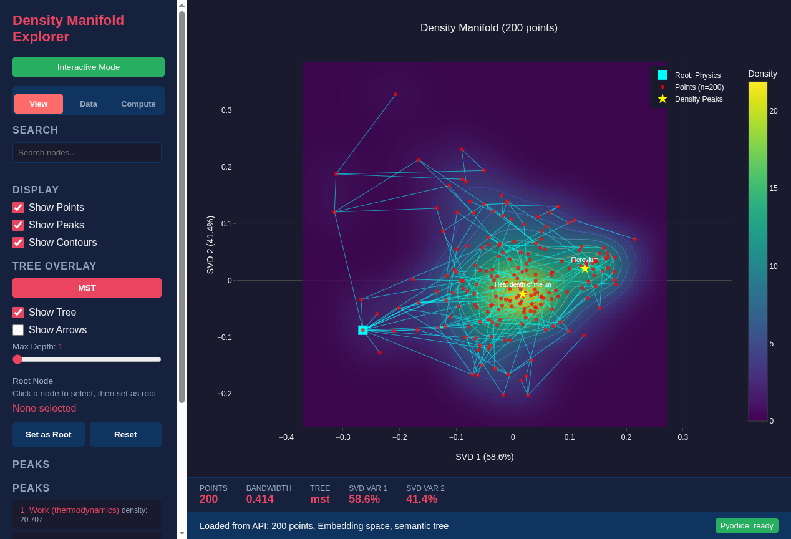
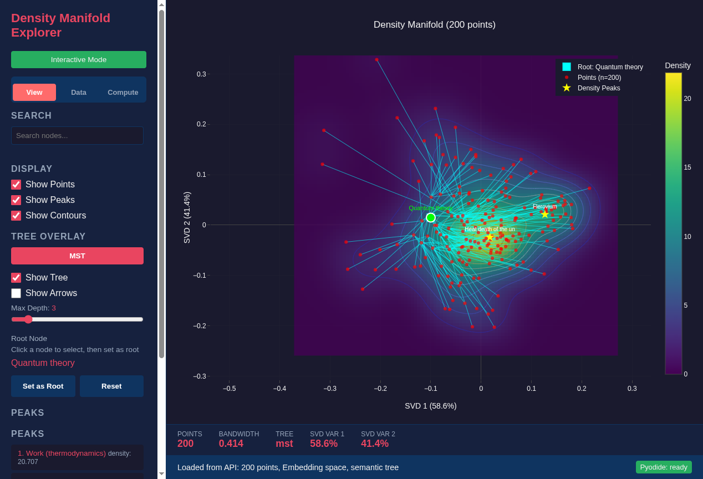

<!--
SPDX-License-Identifier: MIT AND CC-BY-4.0
Copyright (c) 2026 UnifyWeaver Contributors

This documentation is dual-licensed under MIT and CC-BY-4.0.
-->

# Chapter 5: Tree Algorithms

## From Distances to Hierarchy

Given a distance matrix — whether from cosine similarity or a trained model — tree algorithms recover hierarchical structure. The density explorer implements two complementary approaches: **Minimum Spanning Tree (MST)** and **J-guided trees**.

## Minimum Spanning Tree

The MST connects all N points using N-1 edges with minimum total weight. It's the sparsest connected graph that preserves proximity:

```python
from scipy.sparse.csgraph import minimum_spanning_tree

def build_mst(distance_matrix):
    """Build MST from pairwise distances."""
    sparse_dist = csr_matrix(distance_matrix)
    mst = minimum_spanning_tree(sparse_dist)
    return mst
```

### Root Selection

After building the MST, we need to choose a root to orient it as a hierarchy. The density explorer selects the node with **highest degree** (most connections):

```python
degrees = [(len(adj.get(i, [])), i) for i in range(n)]
_, root = max(degrees)
```

This is where the central result emerges: when using the Wikipedia Physics trained distance model, **"Physics" is selected as root**. The MST algorithm, given only pairwise distances from a neural network, independently identifies the hierarchical root of the entire collection.



*MST rooted at "Physics" (depth 1), showing immediate children: Applied physics, Mathematical physics, Thermodynamics, Mechanics, and others. The tree structure recovered from learned distances mirrors Wikipedia's actual category hierarchy.*

### BFS from Root

Once the root is selected, BFS traversal assigns depths and parent-child relationships:

```python
def orient_tree(adj, root):
    """BFS from root to assign depths and parents."""
    visited = {root}
    queue = deque([(root, 0)])  # (node, depth)

    while queue:
        node, depth = queue.popleft()
        for neighbor, weight in adj[node]:
            if neighbor not in visited:
                visited.add(neighbor)
                # neighbor is a child of node
                queue.append((neighbor, depth + 1))
```

## J-Guided Trees

J-guided trees use a different construction strategy based on **k-nearest neighbors**:

```python
def build_jguided_tree(distance_matrix, k=10):
    """Build tree using k-NN guided greedy BFS."""
    n = len(distance_matrix)
    similarity = -distance_matrix  # Convert to similarity

    # Root: highest average similarity (most central)
    centrality = similarity.sum(axis=1)
    root = int(np.argmax(centrality))

    # For each node, find k nearest neighbors
    knn = {}
    for i in range(n):
        neighbors = np.argsort(distance_matrix[i])[:k+1]
        knn[i] = [j for j in neighbors if j != i][:k]

    # Greedy BFS: connect to nearest unvisited k-NN
    visited = {root}
    queue = deque([root])
    edges = []

    while len(visited) < n:
        if queue:
            node = queue.popleft()
            for neighbor in knn[node]:
                if neighbor not in visited:
                    visited.add(neighbor)
                    edges.append((node, neighbor))
                    queue.append(neighbor)
        else:
            # Find closest unvisited node to any visited node
            # ... bridge disconnected components
```

### Key Differences from MST

| Property | MST | J-Guided |
|----------|-----|----------|
| Root selection | Highest degree | Highest centrality |
| Connection strategy | Global minimum weight | Local k-NN |
| Edge count | Exactly N-1 | Exactly N-1 |
| Structure | Long-range optimal paths | Local neighborhood chains |

Both algorithms select "Physics" as root when using the trained distance model. However, the trees look different:

- **MST** produces broader, shallower trees (Physics connects to many top-level categories)
- **J-guided** produces deeper, more chain-like trees (local neighborhoods form natural progressions)

## Depth Filtering

The density explorer allows filtering by depth to examine tree structure at different levels:



*Tree filtered to depth 3, showing the quantum theory branch. At this depth, specific topics like wave-particle duality, uncertainty principle, and quantum entanglement appear as leaves under their parent categories.*

## Max Branching Factor

Real knowledge hierarchies have varying branching factors. The root "Physics" might connect to dozens of subcategories in the MST, making the visualization cluttered. The **max branching slider** limits children per node:

```javascript
function applyMaxBranching(tree, maxBranching) {
    if (maxBranching >= tree.edges.length) return tree;

    // For each parent, sort children by edge weight
    // Keep only the closest maxBranching children
    const childrenByParent = groupBy(tree.edges, 'source');

    for (const [parent, children] of childrenByParent) {
        children.sort((a, b) => a.weight - b.weight);
        // Mark excess children as hidden
        for (let i = maxBranching; i < children.length; i++) {
            children[i].hidden = true;
        }
    }
}
```

When maxBranching = 4, "Physics" shows only its 4 closest children instead of all subcategories. Edge weight sorting ensures the most strongly connected children are kept. This produces cleaner visualizations while preserving the most important structural relationships.

## Root Emergence

The fact that "Physics" emerges as root from both MST (highest degree) and J-guided (highest centrality) algorithms is significant. It means the trained distance model's geometry has a property that:

1. Makes "Physics" the most connected node in the global optimal spanning tree
2. Makes "Physics" the most central node in the local similarity graph
3. Produces both results without any explicit hierarchy labels

This is the central empirical result of this book: **hierarchy is implicit in metric geometry**. A generic graph algorithm, given only the output of a neural distance function, recovers the organizational root of a knowledge base.

---

**Previous**: [Chapter 4: Learned Distances](04_learned_distances.md) | **Next**: [Chapter 6: Fisher Information](06_fisher_information.md)
