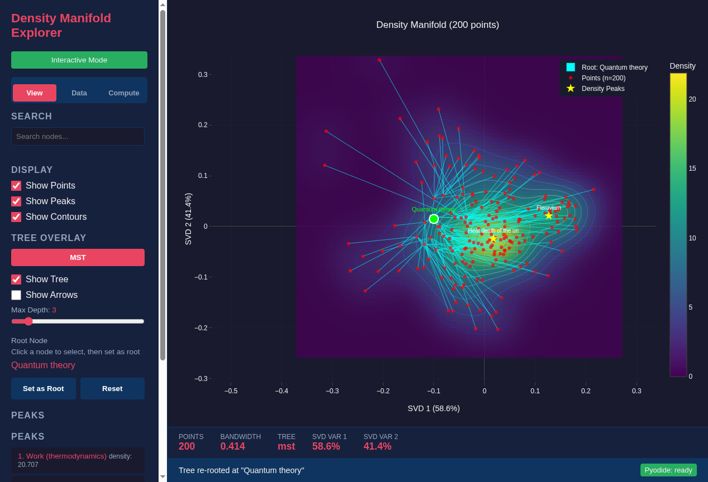

<!--
SPDX-License-Identifier: MIT AND CC-BY-4.0
Copyright (c) 2026 UnifyWeaver Contributors

This documentation is dual-licensed under MIT and CC-BY-4.0.
-->

# Chapter 6: Fisher Information

## Sensitivity, Not Density

A natural assumption is that the most important node in a knowledge base sits at the densest point — surrounded by the most similar documents. But this is wrong. Hub nodes like "Physics" sit in **sparse, convex regions** of the density landscape, not at density peaks.

Fisher information explains why.

## What Fisher Information Measures

Fisher information quantifies the **sensitivity** of a probability distribution to small changes in its parameters. For a density surface f(x; θ):

```
I(θ) = E[ (∂/∂θ log f(x; θ))² ]
```

Informally: if moving a point slightly would significantly reshape the density landscape, that point has high Fisher information. If moving it barely changes anything, it has low Fisher information.

## Density Peaks vs. Geometric Hubs

Consider two types of nodes in the Wikipedia Physics embedding space:

**Density peak nodes** (e.g., "Work (thermodynamics)", "Atom"):
- Surrounded by many semantically similar documents
- Sit in **concave** density regions (local maxima)
- Moving them barely changes the overall density — their neighbors fill the same role
- **Low Fisher information**: the distribution is insensitive to their exact position

**Hub nodes** (e.g., "Physics"):
- Connect multiple clusters without being deep inside any one
- Sit in **convex** density regions (ridges and saddle points between clusters)
- Moving them reshapes the transition zones between clusters
- **High Fisher information**: the distribution is sensitive to their position

## Convex vs. Concave Geometry

The density surface's second derivative (Hessian) distinguishes these regions:

- **Concave** (negative curvature): density peaks, stable cluster interiors. Points here are "replaceable" — removing one barely changes the landscape because neighbors provide redundancy.

- **Convex** (positive curvature): ridges, saddle points, transition zones. Points here are "structural" — they shape the boundaries between clusters. Small perturbations cascade.

"Physics" sits at a convex boundary in the density manifold. It's not the most similar to any cluster — it's the node that defines how clusters relate to each other.

## Re-Rooting Perspective

To see why hub position matters, consider re-rooting the tree at a different node:



*The same MST re-rooted at "Quantum Theory" instead of "Physics." The tree structure changes — what were siblings under Physics become ancestors of each other. The geometric position of "Physics" (at the convex boundary) makes it the natural root because it minimizes total tree distortion.*

When we re-root at a density peak node like "Quantum Theory," the tree becomes less balanced. Topics that should be siblings (thermodynamics, mechanics) end up as ancestor-descendant pairs. The convex boundary position of "Physics" is what makes it the natural root — it sits equidistant from all major branches.

## Connection to Learned Metrics

The trained distance model amplifies the Fisher information distinction. In raw embedding space:
- "Physics" is close to many topics (high cosine similarity)
- But so are other general terms like "Science" or "Natural philosophy"

In the **learned metric space**:
- "Physics" sits at a specific geometric position — the convex boundary between subcategories
- The model has learned that hierarchical parents occupy these boundary positions
- The distance head's flexibility (learned rather than fixed metric) allows it to capture this asymmetric structure

## Why This Matters

Fisher information connects several threads:

1. **Density analysis** (Chapter 3): The density surface has concave (peak) and convex (boundary) regions
2. **Learned distances** (Chapter 4): The trained model places hierarchical parents at convex boundaries
3. **Tree algorithms** (Chapter 5): MST selects the highest-degree node, which sits at convex boundaries because boundary nodes naturally connect to multiple clusters
4. **Hierarchy** (Chapter 8): The hierarchy emerges because structurally important nodes (high Fisher information) are geometrically positioned at inter-cluster boundaries

The geometric insight is: **hierarchy is not about being central in density, but about being central in influence**. Fisher information formalizes this distinction.

---

**Previous**: [Chapter 5: Tree Algorithms](05_tree_algorithms.md) | **Next**: [Chapter 7: Projection Modes](07_projection_modes.md)
