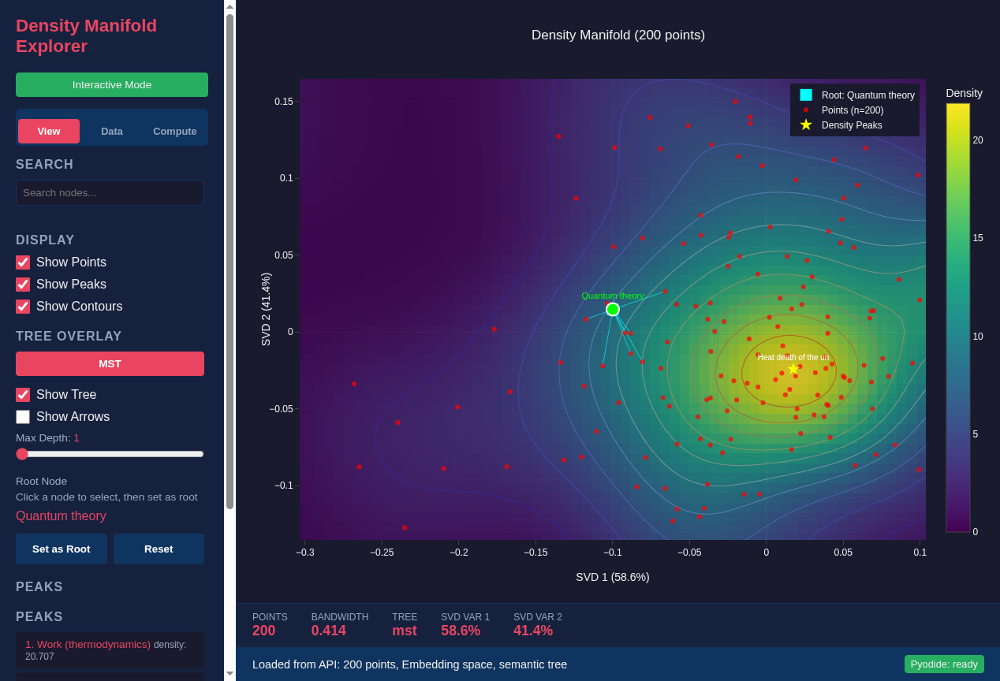

<!--
SPDX-License-Identifier: MIT AND CC-BY-4.0
Copyright (c) 2026 UnifyWeaver Contributors

This documentation is dual-licensed under MIT and CC-BY-4.0.
-->

# Chapter 7: Projection Modes

## Three Views of the Same Data

The density explorer supports multiple 2D projection modes, each revealing different geometric structure in the same set of documents. These are not just different visualizations — they represent fundamentally different geometric spaces.

## Embedding Space (Default)

The embedding projection uses SVD on the raw 768D Nomic embeddings:

```python
def project_to_2d(embeddings, mode="embedding"):
    centered = embeddings - embeddings.mean(axis=0)
    U, S, Vt = svd(centered, full_matrices=False)
    points_2d = U[:, :2] * S[:2]
    var_explained = S[:2]**2 / (S**2).sum()
    return points_2d, S, var_explained
```

**What it shows**: Semantic similarity. Documents that mean similar things cluster together. The two SVD components capture the directions of maximum variance in the embedding space.

**Limitations**: Organizational structure is invisible. "Physics" and "List of Physicists" appear close because they share semantic content, even though they serve different organizational roles.

## Weight Space

When a learned model (bivector projections or orthogonal codebook) is available, the weight space projection shows the geometry of the **transformation** rather than the data:

```python
if projection_mode == "weights" and weights is not None:
    points_2d, singular_values, var_explained = project_to_2d(
        embeddings, mode="weights", weights=weights
    )
```

**What it shows**: How the learned transformation reshapes the embedding space. Points that the model transforms similarly cluster together, even if their raw embeddings are different.

## Wikipedia Physics (Learned Hierarchy)

The trained distance model's 64D hidden layer provides a third projection:

```python
if projection_mode == "wikipedia_physics":
    wiki_projections = compute_wikipedia_physics_projections(inp_emb)
    points_2d, singular_values, var_explained = project_to_2d(
        wiki_projections, mode="embedding"
    )
```

The process:
1. Pass each 768D embedding through the model's `query_proj` network
2. Extract the 64D output (the bottleneck representation)
3. Apply SVD to reduce from 64D to 2D

**What it shows**: Organizational structure. The X-axis correlates with hierarchy depth (r=0.85). Documents are positioned by their role in the knowledge hierarchy, not their semantic content.



*Zoomed view of the Wikipedia Physics projection showing local structure. Nearby points share organizational roles — topics at similar hierarchy depths cluster together, regardless of their specific domain (thermodynamics vs. mechanics vs. quantum theory).*

## Comparing Projections

The same 200 Wikipedia physics articles look different in each projection:

| Projection | Primary axis | Clusters by | Hub position |
|------------|-------------|-------------|--------------|
| Embedding | Semantic variance | Topic similarity | Inside dense region |
| Weights | Transformation similarity | Learned grouping | Varies |
| Wikipedia Physics | Hierarchy depth | Organizational role | Convex boundary |

The key observation: switching projection modes while keeping the same tree overlay reveals how tree structure relates to different geometric views. The MST built from Wikipedia Physics distances looks most natural in the Wikipedia Physics projection, where the depth gradient aligns with the tree's hierarchical levels.

## Projection Mode + Tree Distance Metric

The density explorer separates two independent choices:

1. **2D Projection Mode** — How points are positioned on screen
2. **Tree Distance Metric** — What distances are used for tree construction

These can be mixed. For example:
- **Embedding projection + Wikipedia Physics tree**: See how a hierarchy-informed tree looks in semantic space
- **Wikipedia Physics projection + cosine tree**: See how a semantic-similarity tree looks in hierarchy space

This cross-comparison reveals when semantic structure and organizational structure agree (most subtopics) and when they diverge (meta-articles like "List of Physicists" that are semantically close but organizationally distant).

## SVD Variance Explained

Each projection mode produces different variance explained values:

```
Embedding space:     SVD1=12.3%  SVD2=8.1%  (total ~20%)
Wikipedia Physics:   SVD1=34.7%  SVD2=18.2% (total ~53%)
```

The Wikipedia Physics projection concentrates more variance in the first two components. This means the 64D hidden layer's structure is more "2D-like" than the raw 768D embedding space — the model has learned to compress organizational information into a lower-dimensional manifold.

---

**Previous**: [Chapter 6: Fisher Information](06_fisher_information.md) | **Next**: [Chapter 8: Hierarchical Structure](08_hierarchical_structure.md)
