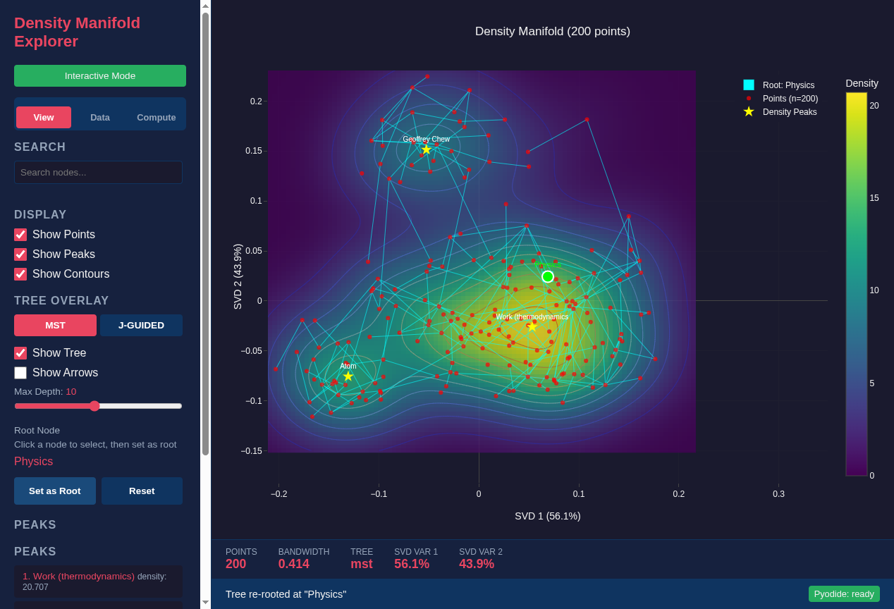

<!--
SPDX-License-Identifier: MIT AND CC-BY-4.0
Copyright (c) 2026 UnifyWeaver Contributors

This documentation is dual-licensed under MIT and CC-BY-4.0.
-->

# Chapter 8: Hierarchical Structure

## How Hierarchy Emerges from Geometry

This chapter synthesizes the preceding chapters into a single claim: **hierarchy is implicit in metric geometry**. Given the right distance function, generic graph algorithms recover hierarchical structure without explicit labels.

## The Pipeline

The complete pipeline from text to hierarchy:

```
Raw text
  → Nomic embedding (768D)           [Chapter 2]
    → Distance model (768→256→64→1)  [Chapter 4]
      → Pairwise distances (N×N)     [Chapter 4]
        → MST construction           [Chapter 5]
          → Root selection            [Chapter 5]
            → Oriented hierarchy      [This chapter]
```

At no point does the pipeline receive explicit hierarchy labels. The model was trained on pairwise distances derived from hierarchical paths, but the tree algorithm operates only on the model's predicted distances.

## What the Model Learns

The trained distance model learns a geometry where:

1. **Siblings are close** — Articles in the same category have small predicted distances
2. **Parents are equidistant** — A parent category is approximately equidistant from all its children
3. **Depth creates a gradient** — Deeper articles are progressively further from the root concept
4. **Cross-branch distance scales** — Articles in different branches have distances proportional to their hierarchical separation

These properties emerge from training on n=5 Manhattan distances over organizational paths. The model discovers them through gradient descent, not through explicit geometric constraints.

## Root Emergence

"Physics" emerges as root because of a geometric convergence:



*The density explorer showing "Physics" as the MST root. It connects to major subcategories (Applied physics, Mathematical physics, Thermodynamics, Mechanics) as direct children. The tree structure mirrors Wikipedia's actual category hierarchy.*

**MST perspective**: "Physics" has the highest degree because it's approximately equidistant from all major subcategories. In the MST, this means edges to "Physics" are competitive (short enough to survive) across many different branches.

**J-guided perspective**: "Physics" has the highest centrality (sum of similarities) because it's the most universally "close" node in the learned distance space.

**Fisher information perspective**: "Physics" sits at the convex boundary between clusters — the position of maximum geometric influence.

All three perspectives converge on the same node, confirming that the hierarchy is a robust geometric property, not an artifact of any particular algorithm.

## BFS Traversal

Once rooted at "Physics," BFS traversal reveals the hierarchy:


*BFS traversal from the "Physics" root, showing depth levels. Depth 1: major branches (Applied physics, Thermodynamics, Mechanics). Depth 2: specific topics within each branch. Depth 3+: detailed articles.*

The depth levels correspond to organizational granularity:
- **Depth 1**: Major physics branches
- **Depth 2**: Specific subfields and theories
- **Depth 3+**: Individual concepts, experiments, and biographical articles

## Depth Gradient in Projection Space

The organizational depth has a spatial interpretation in the learned projection:

| Depth | Region in projection | Example articles |
|-------|---------------------|------------------|
| 1 | Left (low X) | Physics, Science |
| 3 | Center | Thermodynamics, Quantum mechanics |
| 4-5 | Center-right | Wave-particle duality, Entropy |
| 6+ | Right (high X) | Specific experiments, historical articles |

The X-axis correlation of r=0.85 means that 72% of the variance in hierarchy depth is explained by a single spatial dimension. The model has compressed a complex tree structure into an approximately linear gradient.

## What the Hierarchy Gets Right

Comparing the MST hierarchy to Wikipedia's actual category structure:

- **Physics → Applied physics → Engineering physics**: Correct parent-child chain
- **Physics → Thermodynamics → Entropy**: Correct specialization path
- **Physics → Quantum mechanics → Wave-particle duality**: Correct depth ordering
- **Mechanics and Thermodynamics as siblings**: Correct — both are direct children of Physics

## What the Hierarchy Gets Wrong

Some relationships are distorted:

- **Cross-cutting categories**: Articles that belong to multiple categories (e.g., "Statistical mechanics" under both Thermodynamics and Mechanics) get assigned to only one parent
- **Meta-articles**: "List of Physicists" is semantically close to Physics but organizationally distant — the model handles this correctly (large predicted distance), but MST must still connect it somewhere
- **Training data gaps**: Articles not well-represented in the Pearltrees training data may be placed incorrectly

These limitations reflect the fundamental challenge: a tree can only express one organizational axis. Real knowledge structures are DAGs (directed acyclic graphs) or even more complex.

## Interactive Exploration

The density explorer enables interactive investigation of hierarchical structure:

1. **Load data** with Wikipedia Physics projection and tree distance metric
2. **Adjust depth** to examine different hierarchy levels
3. **Set max branching** to declutter dense hubs
4. **Toggle tree overlay** to see hierarchy alongside density contours
5. **Hover** over nodes to see labels, folders, and depth values

The interactive HTML visualization provides the fullest view:

```bash
# Generate interactive organizational depth plot
python tools/density_explorer/examples/plot_organizational_depth.py

# Launch the density explorer
cd tools/density_explorer && python flask_api.py
# Open http://localhost:5000 in browser
```

## Conclusion

The central result of this book: a minimum spanning tree algorithm, given only pairwise distances from a trained neural network, independently selects "Physics" as the root of a tree spanning 200 Wikipedia physics articles. The model was trained on intuition-driven organizational distances, yet its learned geometry encodes hierarchical structure robustly enough for generic graph algorithms to recover it.

This suggests that **metric geometry is a natural language for expressing hierarchy**. The distance function doesn't need to be perfect — it needs to get the relative ordering right. Parents should be equidistant from children, siblings should be close, and cross-branch distances should scale with hierarchical separation. When these properties hold, hierarchy emerges.

---

**Previous**: [Chapter 7: Projection Modes](07_projection_modes.md)
