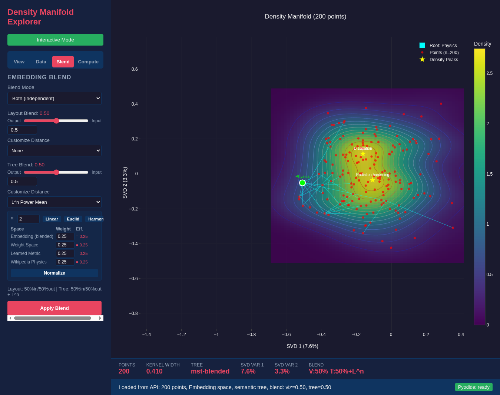

<!--
SPDX-License-Identifier: MIT AND CC-BY-4.0
Copyright (c) 2026 UnifyWeaver Contributors

This documentation is dual-licensed under MIT and CC-BY-4.0.
-->

# Chapter 9: Consensus Distances

## Beyond Single-Space Hierarchy

Chapter 8 showed that hierarchy emerges from a single learned distance function. But the density explorer provides access to four independent distance spaces, each capturing a different aspect of the data:

| Space | Dimensionality | Distance | What it captures |
|-------|---------------|----------|-----------------|
| Embedding | 768D | Cosine | Semantic similarity |
| Weight Space | 64D | Cosine | Transformation recipe similarity |
| Learned Metric | 64D | Euclidean | Organizational proximity |
| Wikipedia Physics | N/A | Predicted | Category hierarchy distance |

Each space answers a different question. Embedding distance asks "do these mean similar things?" Weight space asks "are these transformed the same way?" The learned metric asks "are these organizationally close?" Wikipedia physics asks "are these in the same category branch?"

A natural question: what happens when we combine all four?

## The Product Metric Space

The L^n power mean provides a principled way to combine distance matrices from different spaces:

```
d_consensus = (w_1 * d_1^n + w_2 * d_2^n + ... + w_k * d_k^n)^(1/n)
```

where each `d_i` is a normalized (0 to 1) distance matrix and `w_i` are weights summing to 1.

With n=2, this is the **Euclidean distance in a product metric space**. Each distance space defines one axis of a higher-dimensional distance, and the combined distance is the Euclidean norm across those axes:

```
d_consensus = sqrt(w_1 * d_1^2 + w_2 * d_2^2 + w_3 * d_3^2 + w_4 * d_4^2)
```

This has a geometric interpretation: each distance space defines a "view" of the data, and the product space combines all views into a single metric. Points that are close in all views are close in the product space. Points that are far in even one view get pushed apart.

## Consensus Favors Short Links

The MST algorithm naturally prefers short edges — it minimizes total tree weight. In a single distance space, a long edge survives only if it's the cheapest way to connect two components. In the product space with n=2, the bar is higher: a long edge must be cheap in **all** spaces simultaneously.

This creates a strict consensus effect. Most MST edges stay short because the product distance reinforces agreement between spaces. But when all four spaces independently confirm that two nodes belong together — even if they're spatially distant in the 2D layout — the consensus distance is low enough to justify the long edge.

The long branches that survive this filter are high-signal: they represent links the model is most confident about, validated across multiple independent perspectives.

## Equal-Weight Euclidean Blend

Figure 9.1 shows an MST computed with all four distance spaces weighted equally (0.25 each) and n=2 (Euclidean norm). The result is qualitatively different from a single-space MST.



*Figure 9.1: Density explorer showing a consensus MST with equal-weight Euclidean blending (n=2) across all four distance spaces. The "Physics" root node (green circle, far left) connects to the main cluster via long branches that represent high-confidence hierarchical paths. Settings: Both mode, Layout Blend 0.50, Tree Blend 0.50 with L^n Power Mean customization.*

Two long branches are particularly noteworthy:

**Physics -> List of physicists -> David Lee (Physicist).** This chain connects the root concept through a meta-index article to a specific biographical entry. In embedding space alone, "Physics" and "David Lee" have moderate cosine similarity — they're in the same domain but not semantically close. In Wikipedia's category hierarchy, however, there is a direct path: Physics contains lists of physicists, which contain individual entries. The consensus distance is low because all four spaces agree on this organizational relationship: the embedding captures domain membership, the weight space captures similar transformation patterns, the learned metric captures organizational proximity, and the Wikipedia model captures the actual category path.

**Physics -> Nuclear Physics -> Nuclear.** This chain follows a subject specialization path. "Nuclear Physics" is a direct subcategory of "Physics" in Wikipedia's hierarchy, and "Nuclear" is the core concept within that branch. Again, all four spaces independently confirm these links — the semantic embedding sees topical similarity, the weight and learned metric spaces see organizational closeness, and the Wikipedia model sees the category parent-child relationship.

## Why Long Branches Are Informative

In a standard embedding-only MST, most edges connect semantically similar neighbors. The tree tends to form tangled local clusters with short edges everywhere. Long edges are rare and often represent noise — a single cosine distance that happens to be lower than alternatives.

In the consensus MST, the interpretation reverses. Short edges are the default (four spaces agreeing on local similarity is common). Long edges are exceptional — they require agreement across spaces with fundamentally different geometries. When a long edge survives, it means:

1. **Semantic similarity** (embedding) confirms domain membership
2. **Transformation similarity** (weight space) confirms the model processes both concepts similarly
3. **Organizational proximity** (learned metric) confirms hierarchical closeness
4. **Category structure** (Wikipedia) confirms an actual navigational path

This multi-source triangulation filters out spurious connections and preserves genuine hierarchical relationships.

## The Role of n

The exponent n controls how strictly the consensus operates:

| n | Name | Behavior |
|---|------|----------|
| 1 | Linear | Weighted average — a low distance in one space can compensate for a high distance in another |
| 2 | Euclidean | Product metric — distances add in quadrature, penalizing disagreement |
| -1 | Harmonic | Strongly favors spaces where points are close, even if others disagree |

With n=1, a single space with a very low distance can pull the consensus distance down, even if other spaces show large distances. This allows more edges through — including some that are only supported by one perspective.

With n=2, disagreement is penalized. A large distance in any single space inflates the consensus distance quadratically. Only edges with consistent support across all spaces survive. This is why n=2 produces cleaner long branches — they represent genuine multi-perspective agreement.

## Scale Normalization

Before combining, each distance matrix is normalized to [0, 1] by dividing by its maximum value:

```python
d_normalized = d / d.max()
```

This ensures each space contributes proportionally to its weight regardless of native scale. Without normalization, the Wikipedia distance model (which predicts distances in the range 0-15) would dominate over cosine distances (range 0-2), making the weights meaningless.

## Implementation

The consensus distance is computed by the `compute_custom_distance_matrix()` function in the density explorer backend:

```python
def compute_custom_distance_matrix(
    embeddings, input_embeddings, weights, metric_model,
    space_weights, embedding_alpha, power_n=1.0
):
    # 1. Compute each requested distance matrix
    # 2. Normalize each to [0, 1]
    # 3. Normalize weights to sum to 1
    # 4. Compute L^n power mean
    if abs(n) < 1e-10:
        # Geometric mean: exp(sum(w_i * log(d_i)))
        result = np.exp(sum(w * np.log(d + eps) for w, d in ...))
    else:
        # General case: (sum(w_i * d_i^n))^(1/n)
        result = np.power(sum(w * np.power(d + eps, n) for ...), 1/n)
    return result
```

The function handles the geometric mean (n=0) as a special case using logarithms to avoid numerical issues.

## Connection to Effective Distance

Chapter 4 introduced the effective distance formula for aggregating multiple category paths:

```
d_eff = (sum(d_i^(-n)))^(-1/n)
```

The consensus distance uses a related but distinct formula. The effective distance aggregates multiple paths *within* a single space (the category graph), asking "how close are these nodes considering all possible routes?" The consensus distance aggregates *across* spaces, asking "how close are these nodes considering all possible perspectives?"

Both use the same mathematical family (generalized power means) but with different inputs and interpretations. The effective distance collapses a multi-path graph into a single scalar. The consensus distance collapses a multi-space analysis into a single metric.

## Open Questions

1. **Optimal n**: Is n=2 the best choice for consensus, or should it match the effective dimension of the combined space? The individual spaces have effective dimensions around 4-6 (Chapter 4). The product space may have a different effective dimension.

2. **Unequal weights**: Equal weights treat all spaces as equally informative. But the Wikipedia physics model was explicitly trained on hierarchy, while the embedding space was not. Should hierarchy-aware spaces receive higher weight?

3. **Beyond trees**: The consensus distance produces a proper metric. Could it be used for clustering (HDBSCAN), community detection, or other graph algorithms beyond MST?

4. **Bootstrapping confidence**: With four independent distance estimates, it may be possible to compute confidence intervals for each edge — how much do the spaces agree on this particular link?

---

**Previous**: [Chapter 8: Hierarchical Structure](08_hierarchical_structure.md) | **Next**: [Chapter 10: Physics Mindmap Builder](10_physics_mindmap_builder.md)
